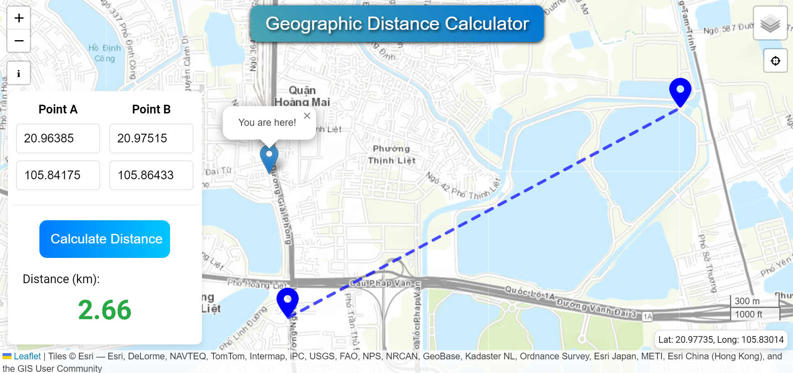

<h1> Geographic Distance Calculation WebGIS </h1>

The webGIS application provides a tool to calculate the geographic distance between 2 points on the Earth surface.

<h2>Credit</h2>

 👨‍🏫 The webGIS developed by <a href='https://vietducng.github.io/'>Viet Nguyen</a> (<a href = 'https://geo.uni-greifswald.de/en/chairs/geographie/translate-to-english-fernerkundung-und-geoinformationsverarbeitung/translate-to-english-team/'>University of Greifswald | Institute of Geography and Geology</a>).

<h2>Method</h2>
🔬 The spherical law of cosines formula was used to calculate distance along the surface of a sphere. It is not the most accurate method for Earth, but it is accurate enough for most purpose. Source: https://www.movable-type.co.uk/scripts/latlong.html.

